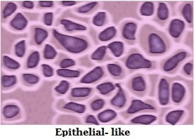
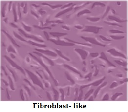
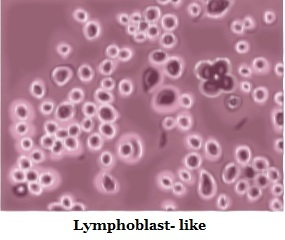

### Theory

"Mammalian cell culture" refers to the cells of  mammals, isolated from specific tissues (i.e., skin, liver, glands, etc.) and further cultivated and reproduced in  artificial medium. It  becomes a major field in modern biotechnology, especially in the area of human health.

During the cultivation of mammalian cells in vitro (ie outside a living organism), some specific difficulties arise in the extraction of  cells from a "safe" tissue. Slow growth rates with doubling times in between 12 and 28 h, low sensitivity, productivity against shear stress due to the lack of a cell wall and complex requirements of growth medium are the challenges in developing techniques for mammalian cell culture. Moreover, many cell lines grow in an adherent manner and a suitable surface for attachment has to be provided for these cells to proliferate. Mammalian cells have originated from  the multi-cellular organisms, they still carried the genetic program of inducing their own cell death; a process called "apoptosis" or "programmed cell death". It can limit culture productivity in biotechnological processes. Another important problem is the finite life-span of primary cells, die after several doublings in vitro. This problem was solved by must be sub cultured or passage.

 

When mammalian cells are cultured in vitro, the investigator is attempting to reproduce physiological environment in order to maintain and analyze the normal responses and functions. The culture medium is an important component of the in vitro environment.

 

For tissue culture media  many different recipes are available and each laboratory must determine which medium best suits their needs. Individual laboratories  used commercially prepared medium or self prepared. Commercially available medium are highly sterile and ready-to-use liquid, in a concentrated liquid or  powdered form.Instead of  providing nutrients for growing cells, medium is generally supplemented with fungicides and antibiotics, or both to inhibit contamination.

 

Dulbecco's Modified Eagle Media (DMEM) is a basal medium consisting of amino acids, vitamins, gulcose, salts,  and a pH indicator, which contains no proteins or growth promoting agents. Therefore, it needs supplementation to be a "complete" medium. It is commonly supplemented with 5-10% Fetal Bovine Serum (FBS). DMEM used a sodium bicarbonate buffer system (3.7 g/L) and therefore requires artificial levels of CO2 to maintain the required pH. 7-10% CO2 is optimal but many researchers successfully use it in 5% CO2. The potential problem with too low CO2 level is that the pH may become too high. When exposed to ambient levels of CO2, the sodium bicarbonate in the medium will cause DMEM to become basic very rapidly.

 

Most animal cell lines and primary cultures grow as a single thickness cell layer attached to a plastic or glass substrate. The available substrate surface is covered by cells, the growth slows and then ceases. Thus, in order to keep the cells actively and healthy growing, it is necessary to subculture them at regular intervals. Usually, this sub cultivation process involves breaking the bonds or cellular 'glue' that attaches the cells to the substrate and to each other by using proteolytic enzymes such as trypsin, dispase, or collagenase. Sometimes, these enzymes or dissociating agents are combined with divalent cation chelators such as EDTA which binds calcium and magnesium ions. The loosened cells are  removed from the culture vessel, counted, diluted and subdivided into new vessels. Cells then reattach, begin to grow, divide and after a suitable incubation period (depending on the initial inoculum size, cell lines and  growth conditions), and again reach confluency or  saturation. At this point, the sub cultivation cycle is repeated.

 

### Cell Culture Systems
 

For growing cells, two  culture systems are used. They are mainly based on  the ability of the cells to either  attach to a glass or treated plastic substrate, known as Monolayer Culture Systems and the  floating free in the culture medium is known as Suspension Culture Systems.
 

Monolayer cultures are usually grown in tissue culture treated dishes, T-flasks, roller bottles, petriplates or multiple well plates, the choice should based on the number of cells needed, the nature of the culture,  personal preference and cost.

 

Suspension cultures are usually grown either:

1. In magnetically rotated spinner  or shaken Erlenmeyer flasks where the cells are keep it in a  fully suspended  medium.

2. In stationary culture vessels like T-flask and  bottles  where, the cells are not kept agitated, they are unable to attach firmly into the substrate.
 

Many cell lines, mainly those from normal tissues, are considered to be Anchorage-Dependent, that is, they can grow when  it is attached to a suitable substrate. Some cell lines which is  no longer considered normal  are frequently able to grow either attached to a substrate or free floating  in suspension; are Anchorage-Independent. Some normal cells, such as those found in the blood, do not normally bind to substrates and grow in the suspension.

 

 

### Types of Cells
Cultured cells are usually described based on their morphology or their functional characteristics. There are three basic morphologies:

#### 1. Epithelial-like: 
cells  which is attached to a substrate and appear flattened and polygonal in shape.

#### 2. Fibroblast-like: 
cells which are attached to a substrate and appear bipolar and elongated, frequently forming swirls in heavy cultures.

#### 3. Lymphoblast-like: 
cells which do not attach normally to a substrate but it remain in suspension with a spherical shape.

 

 

### Adherent cells
 

Adherent cell lines will grow in vitro until they have covered the surface area available or  medium is depleted of nutrients. Before this point the cell lines should be sub-cultured in order to avoid the culture dying. For subculture the cells they need to be brought into the suspension. Degree of adhesion changes from cell line to cell line but in the most of cases proteases, e.g. trypsin, used to release the cells from the flask. This may not be appropriate for some lines where exposure to the proteases is harmful or the enzymes used  to remove membrane markers or receptors of interest. In these cases cells should be brought into the suspension into a small volume of medium  with the help of a aid of cell scrapers.

 

#### Storage by freezing
 
Long term freezing of cells can be carried out to, preserve cells, avoid senescence, reduce the risk of contamination, and minimize effects of genetic drift. Cryoprotective agents are used for the freezing purpose . Without cryoprotective agent freezing would be lethal to the cells in most cases. Commonly, a cryoprotective substance like dimethylsulfoxide is used in conjunction with complete medium for the preservation of  cells at -70°C or lower. DMSO can reduce the freezing point and allows  a reduced cooling rate. Gradual freezing decreased  the risk of  cell damage and ice crystal formation.

 

#### Resuscitation of Frozen Cell Lines
 
When cryopreserved cells are needed for study, it is vital to show cells correctly in order to maintain the viability of the culture and enable the culture to recover  quickly. Some cryoprotectants, such as DMSO, are toxic above 4°C therefore it is essential that cultures are thawed quickly and diluted in culture medium to reduce the toxic effects.

 

#### CAUTION

Protective clothing, particularly insulated gloves and goggles, should be worn when removing frozen vials or ampules from the liquid nitrogen freezer. The room having the liquid nitrogen freezer should be well-ventilated. Make sure that liquid nitrogen does spill on the skin.

 

#### Additional Materials
 
1. 70% (v/v) ethanol.
2. Complete medium /20% FBS (e.g. supplemented DMEM-20).

NOTE: All incubations should be performed in a humidified 37°C, and  5% CO2 incubator unless otherwise specified.
